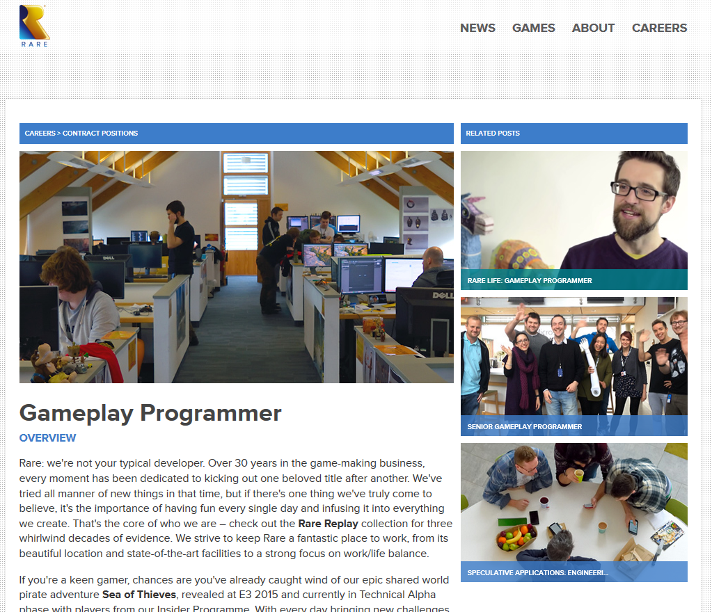
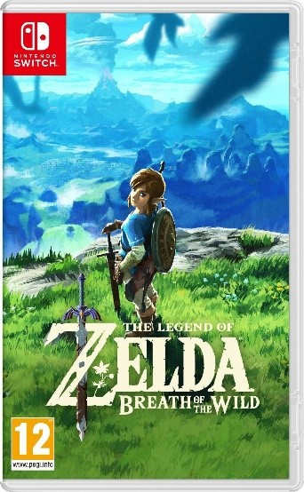
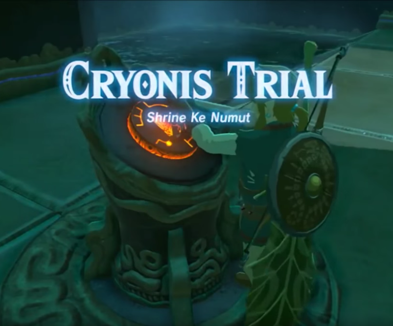
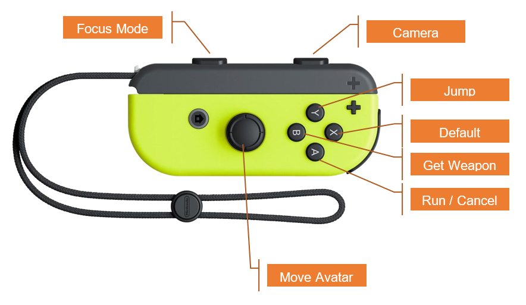
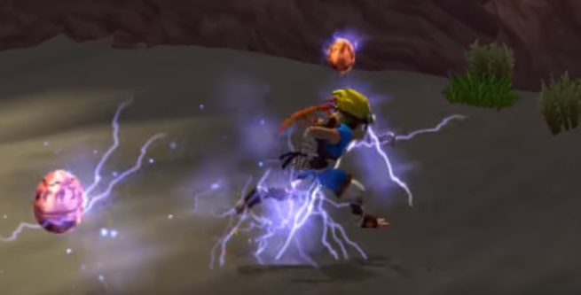

# Gameplay Programming Module Handbook UFCF7M-30-2

__Sean Butler__  
__Sean2.Butler@uwe.ac.uk__

## Change Log

| Date | Description |
| --- | --- |
| 26th Jan 2018	| Initial Version.
| 29th Jan 2018	| Added Partial Schedule. Added Partial Scheme.
| 30th Jan 2018	| Added more details to the Door Switch Activity. Completed Schedule. Created Avatar Activity.
| 1st Feb 2018	| Added Placeholder Sections for Rest of Activities. Adjusted Marking Rubric. Extended Avatar, Added Particles and Camera Sections. Tweaked Module Component Structure Description in response to feedback.

## Course Overview

Most of what we will cover can be classified into 4 broad areas: Coding, Science, Gameplay & Professionalism. We might also think of these as doing, knowledge, objectives and being, respectively.

__Coding__
 * Software Design Patterns
 * Deep Dive into Some Tools

__Science__
 * Comp Science, Maths & Physics

__Gameplay__
 * Game Objects & Features
 * Gameplay Feel

__Professionalism__
 * Job Marketplace
 * Team & Communication

 ## Learning Methods
 The learning method is for you to carry out gameplay implementation challenges. Each challenge is designed to raise an issue pertinent to the role of gameplay programmer.

  * You will use the internet to research your own solutions to these problems. You may need to do some exploratory programming too.
  * You then attempt a solution.
  * You will receive feedback throughout the lectorials either 1 on 1 or with the group as a whole. In this way you have the opportunity to try something then reflect on it and improve it further.
  * Then try to incorporate what you have learned from the feedback and reflection
  * The challenges set will increase in sophistication and build to a larger whole.

 ## External Sources of Assets and Code

 While we will be using animation and mesh assets freely available from the asset store, _we will not be using any external code_. All the code submitted must be written by yourselves.

 It is ok if you have taken architecture, design or other ideas  from pre-existing code or tutorials. You must write the submitted code yourselves and you must reference all sources.

 When/if you do refer to any sources please keep a note of the URL etc so we can collate them for the whole group later.

 ## Assignment

 The assessment is split into two components, A & B.

 __Component A__ is 75% of your final mark and is split into two sections A1 the Gameplay Programming Portfolio and A2 Gameplay Integration Project.

 __Component B__ is 25% of your final mark and is not further subdivided.
 You must achieve a passing grade in both components to pass the module.

 ### Component A – Controlled Conditions

 - 75% of your final mark
 - Two sections

 Under controlled conditions, which means we must be able to see you participate and progress within the tutorials. If you do not attend or only make progress away from the tutorials we won’t be able to say it was controlled conditions. You may lose marks and fail the module.

 #### A1 Gameplay Programming Portfolio

 - Individual Work
 - 60% of 75% = 45 Marks
 - 9 * 5 = 45 Marks

| | Absent or Token	| Poor	| Pass	| Good	| Great	| Amazing |
|---|---|---|---|---|---|---|
|Switches, Doors Logic & Cutscene	| 0	| 1	| 2	| 3	| 4	| 5 |
|A Basic Avatar                     | 0	| 1	| 2	| 3	| 4	| 5 |
|Collectable	                       | 0	| 1	| 2	| 3	| 4	| 5 |
|A Follow Camera                   	| 0	| 1	| 2	| 3	| 4	| 5 |
|Camera Controllers	                | 0	| 1	| 2	| 3	| 4	| 5 |
|Platform Sequence 	                | 0	| 1	| 2	| 3	| 4	| 5 |
|Combat                             | 0 | 2 | 4 | 6 | 8 | 10 |
|Air & Wall Jumps                   | 0	| 1	| 2	| 3	| 4	| 5 |
|Example Descriptions | Nothing or  minimal | Partial functionality | Functional with bugs | Complete & no major bugs | Complete, no major bugs, polished and high quality | Extensive Additional functionality, polished, high quality and bug free |

#### A2 Gameplay Integration Project

Build a larger system as a group, with each of you working on separate subsystems and integrating them together.

- Group Work
- 40% of 75% = 30 Marks

The exact marking scheme will be supplied to you. You will be marked on the size, quality of your gameplay and technical standard of your systems.

### Component B

25% of your final mark

#### B1 Technical Feature Report

 - Individual Work
 - 100% of 25% = 25 Marks

The exact marking scheme will be supplied to you. You will be marked on the content and quality of your writing.

## Schedule

| Week | Session (Day) | Description | Activity | Assessment |
|---|---|---|---|---|
| 1    | 1 (Tue)   | Module Overview & Research the Role              | 1 |   |
| 1    | 2 (Fri)   | Research State Machine Patterns                  | 2 |   |
| 2    | 1 (Tue)   | Basic Switches, Door Logic and a Simple Cutscene | 3 |   |
| 2    | 2 (Fri)   | Finish & Mark Basic Logic & Cutscene             | 3 | Y |
| 3    | 1 (Tue)   | Implement a Basic Avatar                         | 4 |   |
| 3    | 2 (Fri)   | Finish & Mark Basic Avatar                       | 4 | Y |
| 4    | 1 (Tue)   | Collectables & Particles                         | 5 |   |
| 4    | 2 (Fri)   | Finish & Mark Collectable                        | 5 | Y |
| 5    | 1 (Tue)   | Slick Controllable Gameplay Camera               | 7 |   |
| 5    | 2 (Fri)   | Finish & Mark Gameplay Camera                    | 7 | Y |
| 6    | 1 (Tue)   | Special Camera Controllers                       | 6 |   |
| 6    | 2 (Fri)   | Finish & Mark Special Camera Controllers         | 6 | Y |
| 7    | 1 (Tue)   | Moving Platforms Sequence                        | 8 |   |
| 7    | 2 (Fri)   | Finish & Mark Platforms                          | 8 | Y |
| 8    | 1 (Tue)   | Combat                                           | 9 |   |
| 8    | 2 (Fri)   | Finish & Mark Combat                             | 9 | Y |
| 9    | 1 (Tue)   | Air Control & Wall Interactions                  | 10 |   |
| 9    | 2 (Fri)   | Finish & Mark Air & Wall Interactions            | 10 | Y |
| 10   | 1 (Tue)   | Group Project Kick Off                           | 11 |   |
| 10   | 2 (Fri)   | Group Project                                    | 11 |   |
| 11   | 1 (Tue)   | Group Project                                    | 11 |   |
| 11   | 2 (Fri)   | Group Project                                    | 11 |   |
| 12   | 1 (Tue)   | Group Project                                    | 11 |   |
| 12   | 2 (Fri)   | Group Project Demo                               | 11 | Y |

--------

## Activity 1 - Research The Role

The purpose of today’s session is to consider what a gameplay programmer is and what they do.

 It’s a normal professional activity to be expected to talk in front of your peers with little or no preparation time. On occasions you will be expected to prepare presentations on topics related to your job without sufficient notice.

 - Research and Report the Definition of a Gameplay Programmer
 - Spontaneous Research and Presentation on the Definition
 - Arbitrary Groups of 3
 - Use Job Descriptions, Encyclopaedias, Images, Recruiters etc
 - Q&A Session

--------

 ## Activity 2 – Where Are You

 The purpose of today’s session is to expose your current experience of gameplay programming.

 1.	Show and Tell
 2.	Present Some Gameplay Programming You Have Already Done
 3.	Describe the Features
 4.	What you Did and What You Learned from doing it
 5.	What might you do differently next time?

A normal team management and motivation activity is to have a show and tell towards the end of a sprint or at regular (weekly?) intervals.

You may be required to demonstrate what you have made to the wider team, to discuss the implications of your work and to find ways to help other team members through this talk.

--------

## Activity 3 - Switches and Doors

__This activity is part of your portfolio assessment.__

You are making a hybrid of Zelda Breath of the Wild and Super Mario 3d World. The gameplay is inspired by Zelda. The camera and control scheme are more like Mario’s. So the gameplay is like a shrine/dungeon, but built upon a regular axis aligned grid and the camera and avatar tend to follow that grid.

|Zelda| X |Mario 3D|
|:-:|:-:|:-:|
| ||  |

The designer has worked on the high concept and some artwork, but no prototyping or proof of concepts have been made.

 - Zelda like gameplay with Hybrid Isometric 3d style camera
 - Console Controller
 - Using free animations and models from the Asset Store
 - Exploratory and iterative development

### Step 1 - Create a Generic Gameplay Scenario as follows

In a grey-boxed room create a wall switch and a door. The wall switch should stick out from the wall slightly. It should flatten when the player hits on it. Use the attack left for the player ‘hitting’ hitting the switch.

The effect should be to initiate a single shot panning/tracking cutscene in which we see, the switch, the player and the door. Think about how Link access and initialises shrines for the first time.

 - https://youtu.be/L_ubt86BMsk?t=24m29s
 - https://youtu.be/L_ubt86BMsk?t=25m11s

We don’t have the high end assets to create a complicated scene like this, so our cutscene should show the hand and the switch touching, the avatar in context and the effect of the logic, which in this case is the door opening.

You must balance the needs of the player to hit the switch without fiddly steering against the visual bugs which might occur if the player can hit the switch while the avatar is off their mark. Fiddly steering and visual glitches will both result in lower marks.

### Step 2 - Find and Fix All the Bugs

Work with (or against) your neighbour to test and break each others systems. You must get into the habit of handing it to a colleague and getting feedback.

Build you system defensively so a QA person cannot break it.

### Step 3 - Polish It

Polish is about feel, the best way is to play your system and get others to play it and tell you what they like & dont like. Here are a couple of hints:

The avatar’s hand must interact with the switch nicely. If it embeds itself too far or it doesn’t touch it properly then that would be a bug. How can you achieve this if the player approaches the button from different angles?

Imagine the level designer is using the same code in multiple places throughout the game. What if the switch and door were further apart? What new bugs might occur in each new arrangement.

Does the system reset properly? Can the payer return through the door? Should they be able to, etc.

The player may go through this activity (say) 200 times in a game. How are you going to make it so they don't hate going through doors by the end of the game?

### Step 4 - Show it to me to get it ticked Off

Score!

### Notes

Start Using the Standard Assets Avatar. But you might want to make a simple walking avatar with a basic follow camera using the FREE asset packs from vendor EXPLOSIVE on Unity Asset Store.

--------

## Activity 4 - Basic Avatar

__This activity is part of your portfolio assessment.__

Check out the complete list humanoid animations available from the asset store compatible from the EXPLOSIVE vendor we mentioned last week. This week you should remove the standard assets avatar and begin to build your own.

### Step 1 - Technical Preparation

What animations are available from the vendor? They have multiple free packs you can access which all seem to work together. What would be a minimal set of actions? How will the available actions affect the possible gameplays?

When the avatar is small it doesn’t matter too much, but when it grows, the approach you choose to implement is going to affect how you extend the functionality most easily. You should be able to defend your decision.

### Step 2 - Implement your own Simple Avatar

No longer using Ethan (The Standard Asset Avatar) build you own animations state machine and 3rd person avatar controller. Include as many of the animations as you can find.

### Step 3 - Implement a Control Scheme

Assume you will have single Joy Con as the controller. To start with use the pc keyboard, and pretend. Later you can use any (xbox/ps) console controller to follow a similar scheme. We don’t have any joycons for you, so just pretend.

As stated previously the gameplay is on a grid, like super Mario 3d. So the character and camera should ultimately tend to align themselves with the axis, but in a nice way.

Work with a free cam in the early versions, but we will make a weird console style camera control scheme in a later session.

| Intent | JoyCon | PC | XBOX |
|---|---|---|---|
| Steer Character	| 1 Thumbstick (2 Analog Axis) | Use WASD | Left Thumbstick |
| Normal Actions | 4 digital push buttons arranged in a diamond | ? Arrow Keys?| 4 digital push buttons arranged in a diamond |
| Steer Camera	| Other Shoulder digital button & 4 digital push buttons arranged in a diamond | ?Ctrl & Arrow Keys? | Right Thumbstick |
| Combat Action | One Shoulder buttons 4 digital push buttons arranged in a diamond | ?Shift & Arrow Keys?	| One Shoulder buttons & 4 digital push buttons arranged in a diamond |
| Menus etc	| 2 System Buttons | Space, escape, return etc | Start |

### Step 4 - Find and Fix All the Bugs

Your avatar must work nicely with the cutscene you made previously.

Imagine a level designer is going to use this to traverse many levels throughout the game. Build a test level out of primitives to test your avatar's responses to walls, boxes, slopes, etc etc. The more robustly you can do this the fewer bugs we can find the more marks you will get.

### Step 5 - Show it to me to get it ticked Off

Whoohoo!

### Questions

 - The same avatar and gameplay might have to be achieved seamlessly on all the consoles and on pc. How might you build an architecture to handle this?
 - Sometimes a cutscene or special case might take control from the player and drive the avatar. Whats a good way to implement this?
 - In a system which uses contextual/default actions, do we need the complete animation set in every scene? Perhaps a switch animation only needs to be loaded in a scene which actually has switches. How would you build a system which can be extended dynamically depending on what gameplay has been implemented?

### Notes

Lloyd has a big set of console controllers locked in his cupboard somewhere, perhaps you can borrow one from him? Probably easiest to go to the resources room and borrow an Xbox controller from them to work with.

--------

## Activity 5 – Collectables and Special Effects

__This activity is part of your portfolio assessment.__

You have been tasked with designing and implementing a couple of in game collectables. Both are magical and offer their benefit for a limited time on collection.

You may use free sprites from the internet or asset store if you like, but the particle systems and other special effects must be your own.

One provides a speed boost, the other a double jump.

You will need to extend your simple test environment for your new abilities.

Make sure that the collectable communicates everything necessary about itself in a glancible way to the player.

### Step 1: Take a look at the collectables in Jak & Daxter

This video should give you an overview of a few.

https://www.youtube.com/watch?v=h9dY6gv1hzA

Think about these questions when reviewing the collectables and their special effects.

 - How many different kinds of particles and effects are running in each collectable?

 - How many effects are layered together in each individual collectable?

 - How does the system communicate something about the specific nature of the collectable's effect.

 - What opportunities exist within the system to communicate current status of the collectable's effect.

 - Some collectables show their magic before collect, it is transferred and goes with the player for a while, and then dies out. Can you tell these visually from the effects?

You can a simple primitive for the actual collectable, nothing to sophisticated, try to make it suit the effect.

### Step 2: Implement a collectable

Implement a collectable.

The player should gain a temporary speed boost. Its effect is immediate.

If you collect more than one, the duration of the second overwrites the first.

### Step 3: Implement another collectable

Implement a collectable.

The player should gain a double jump, which they can use once, when  they jump.

If the player collects more than one, the number of double jumps they can do accumulates and also stays with them until used. No triple jumps though.

### Step 4 - Test

Show your collectables and effects to a colleague, have them test them out and give you feedback. Consider implementing the feedback.

### Step 5 - Score!

Show it to me to get it marked!

### Questions:

 - Every collectable has a significant amount in common. How are you going to implement the collectable given that there will be another, and in all likelihood the designer will probably need many more.

 - What memory issues are possible from levels with lots of collectables and particles? How might you build your system to alleviate these?

 - When your collectables are in a group are they in sync with each other?

--------

##  Activity 6 – Controllable Follow Cam

 __This Activity is part of your portfolio assessment.__

 Consider the cameras of Super Mario 3d World, Zelda and Oceanhorn.
Google them and take a look at some lets plays on youtube.

 In our case the designer wants a similar camera:

 - With a ability to snap in a nice smooth & soft way to the NSEW axis.
 - With a ability to focus (z-lock) on to a local enemy being fought.

Your control scheme should work across multiple controllers.

| Intent | JoyCon | PC | XBOX |
|---|---|---|---|
| Steer Camera | Other Shoulder digital button. 4 digital push buttons arranged in a diamond | ? | Second Thumbstick |

Do not implement a free mouse look style camera in your final version. The problem you have is that some controllers do or don’t have a second thumbstick giving the additional two axis necessary for free camera control.

### Questions

 - If we have a camera that lerps to the next compass point (90deg) smoothly then how might you control that with a second thumbstick?
 - How might you create an experience that is uniform or at least feels similar across multiple different platforms?

--------

## Activity 7 – Special Camera Controllers

You have been tasked with making some camera controllers for an action platformer. The level designers need to be able to override the existing camera when the player enters certain regions.

### Sideways Platforming Sequence. Commonly Known as 2.5d Platforming.

Build a Player/ Camera Controller and Associated System which allows the player to easily transition into and out of 2.5 d gameplay. The player should be constrained to a spline and the camera behaviour changes to suite the more jumpy focussed gameplay.

Take a look at Klonoa or one of the many 2.5d platformers which proliferated on the Playstation and Nintendo platforms.

https://www.youtube.com/watch?v=TXcaAW1cKmM

### Spiral Platforming Sequence in a 3d Environment

Build a Camera Controller and Associated System which allows the player to easily transition into and out of a spiral platforming sequence.

### Complicated Constrained Environment

--------

## Activity 8 – Moving Platform Sequence

__This Activity is part of your portfolio assessment.__

Imagine two platforming sequences.

 - A series of cars driving along a road, tunnels, bridges, tree branches, road signs etc are all hazards in your way.

 - A Gloopy Polluted River flows along a canyon and over a waterfall, riding the river are a series of barrels.

--------

## Activity 9 – Air Controls and Wall Interactions

__This Activity is part of your portfolio assessment.__

Consider the Air Controls of Mario and Super Meat Boy.

--------

## Activity 10 – Melee Combat

__This Activity is part of your portfolio assessment.__

Consider the melee combat of Zelda.

--------

## Activity 11 - Group Project

__This Activity is part of your group work.__
